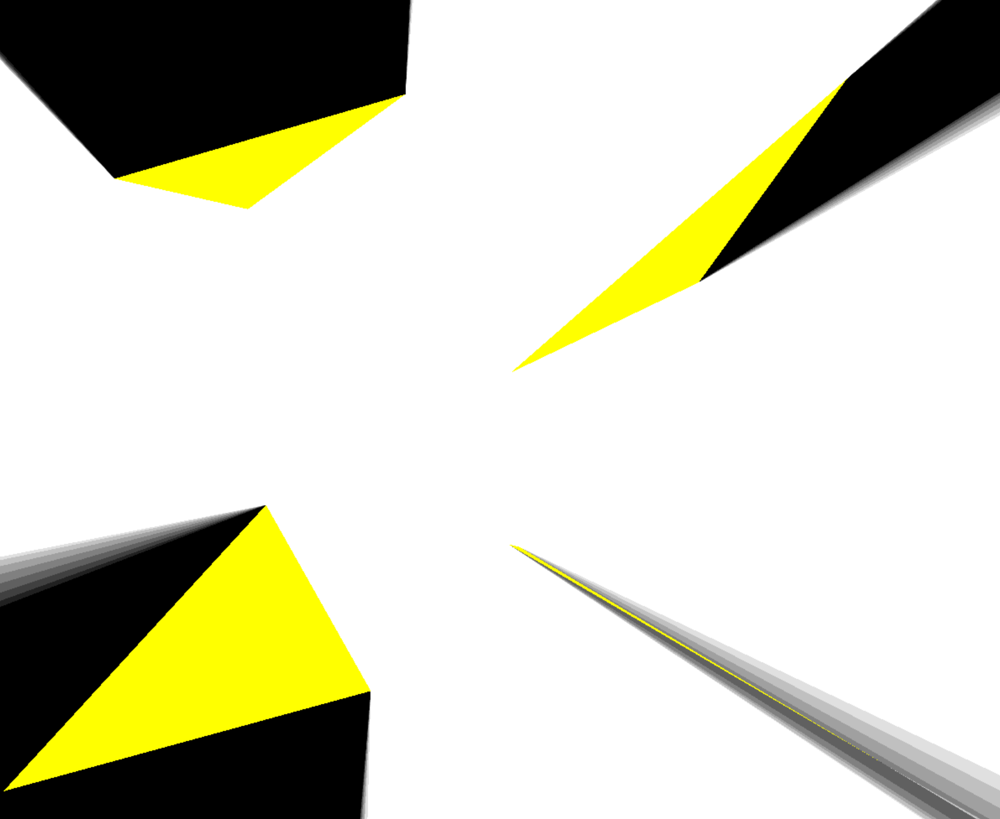

# 2D_DynamiczneCienie

# Opis projektu
2D_DynamiczneCienie to aplikacja 2D stworzona przy użyciu OpenGL oraz PyGame. Celem projektu jest stworzenie interaktywnej aplikacji wizualizacyjnej, która wykorzystuje technologię renderowania 3D w czasie rzeczywistym oraz tym samym zaliczenie przedmiotu do szkoły.



## Wykorzystane technologie i biblioteki:

    Python – Język programowania, w którym została stworzona aplikacja.
    OpenGL – API graficzne, które umożliwia renderowanie grafiki 3D.
    PyGame – Biblioteka umożliwiająca łatwą obsługę okien, eventów, oraz interakcji z użytkownikiem, wykorzystywana do obsługi wejść, renderowania okna gry oraz używana ze względu na bibliotekę przydatnych struktur jak Vector3
    NumPy – Biblioteka do obliczeń numerycznych, która może być wykorzystywana do obliczeń geometrycznych, matematycznych w aplikacji oraz do poprawnej obsługi parametrów w OpenGL.
    random – Moduł używany do generowania losowych liczb, służy do dynamicznego stworzenia 4 losowych poligonów
    math – Moduł używany do różnych operacji matematycznych oraz w celu dostępu do zmiennych matematycznych, takich jak stała Pi, funkcje trygonometryczne (np. sin, cos, atan2).

## Funkcjonalności aplikacji:

    Renderowanie – Aplikacja umożliwia renderowanie obiektów przy użyciu OpenGL. Sceny są wyświetlane w czasie rzeczywistym, umożliwiając płynne przejścia między widokami.
    Interakcja z użytkownikiem – Dzięki PyGame użytkownik może wchodzić w interakcję z aplikacją za pomocą myszy. Możliwe jest poruszanie się po wirtualnym środowisku za pomocą kursora.
    Obsługa świateł – Aplikacja wykorzystuje techniki oświetleniowe 2D do uzyskania ciekawego efektu cieni 2D.
    Rozszerzalność – Aplikacja może być rozbudowywana o dodatkowe elementy, takie jak fizykę obiektów czy interakcje z użytkownikiem w bardziej zaawansowany sposób.
    Opcje graficzne – Jest możłiwość dostosowania jakośći Cieni 2D oraz ustawienie rozdzielczości ekranu 

## Cel projektu:

Celem projektu 2D_DynamiczneCienie jest stworzenie aplikacji wykorzystującej otwarte biblioteki oraz API w kontekście grafiki 3D. Aplikacja może służyć jako narzędzie do nauki programowania grafiki komputerowej lub jako baza do zaliczenia projektu do szkoły lub na studia.

# Wymagania systemowe
Projekt jest napisany w języku Python i wykorzystuje biblioteki OpenGL oraz Pygame. Upewnij się, że masz zainstalowane następujące oprogramowanie:

- **Python** w wersji 3.10
- **pip** (Python package installer) do instalacji zależności
- **Virtualenv** (zalecane do stworzenia środowiska wirtualnego)
- **OpenGL 3.3** Karta graficzna obsługująca OpenGL 3.3 lub wyższą wersję.

# Instrukcja dla dewelopera

Aby rozpocząć pracę z projektem, wykonaj poniższe kroki.

## Instalacja
1. **Sklonuj repozytorium** na swoje lokalne środowisko:

    ```bash
    git clone https://github.com/<twoja_nazwa_uzytkownika>/<nazwa_repozytorium>.git
    cd <nazwa_repozytorium>
    ```

2. **Utwórz i aktywuj wirtualne środowisko:**

    - Jeśli nie masz jeszcze zainstalowanego `virtualenv`, możesz zainstalować go używając `pip`:

    ```bash
    pip install virtualenv
    ```

    - Następnie utwórz wirtualne środowisko i aktywuj je:

    ```bash
    virtualenv venv
    source venv/bin/activate   # Na systemie Linux/macOS
    venv\Scripts\activate      # Na systemie Windows
    ```

3. **Zainstaluj zależności** wymagane do uruchomienia projektu:

    ```bash
    pip install -r requirements.txt
    ```

    (Upewnij się, że masz plik `requirements.txt` w repozytorium, który zawiera wszystkie zależności, np. `pygame`, `PyOpenGL` itp.)

4. **Uruchom projekt**:

    Po zainstalowaniu wszystkich zależności możesz uruchomić aplikację lokalnie:

    ```bash
    python main.py
    ```

    Gdzie `main.py` jest głównym plikiem uruchamiającym aplikację. Zastąp nazwą pliku, jeśli używasz innego.

# Instrukcja dla użytkownika

## Jak uruchomić aplikację

1. W celu pobrania aplikacji, kliknij w poniższy link lub przejdź do zakładki **Releases** w repozytorium:
   - [Pobierz aplikację](https://github.com/JakubDz4/2D_DynamiczneCienie/releases/tag/school)

2. Po pobraniu aplikacji, rozpakuj pliki (jeśli są w formacie ZIP) i przejdź do folderu, w którym znajdują się pliki aplikacji.

3. Znajdź plik `aplikacja.exe` i uruchom go, klikając dwukrotnie na plik.

## Jak z niej korzystać

- **Poruszanie światłem**: Aby poruszać światłem w aplikacji, używaj kursora myszy.
- **Zamykanie aplikacji**: Aplikację zamkniesz klikając w przycisk **X** w prawym górnym rogu okna.
- **Zmiana opcji**: Aby zmienić opcje aplikacji, edytuj plik `config.ini` w folderze z aplikacją. W pliku tym możesz zmieniać ustawienia takie jak:
  - shadowQuality = 8
  - shadowQualityStep = 0.015
  - screenWidth = 1200
  - screenHeight = 1000

# Informacje o autorze

Projekt został stworzony przez [Barnaba]. 

[GitHub: Barnaba](https://github.com/JakubDz4)

# Licencja

Ten projekt jest udostępniony na licencji MIT. Szczegóły licencji można znaleźć w pliku `LICENSE` w tym repozytorium.

## Krótkie podsumowanie licencji MIT:
- Możesz korzystać, kopiować, modyfikować, łączyć, publikować, dystrybuować, sublicencjonować i/lub sprzedawać kopie tego oprogramowania.
- Oprogramowanie jest dostarczane "tak jak jest", bez żadnych gwarancji.
- Wszelkie kopie oprogramowania muszą zawierać oryginalną informację o licencji MIT i autorze.

  
